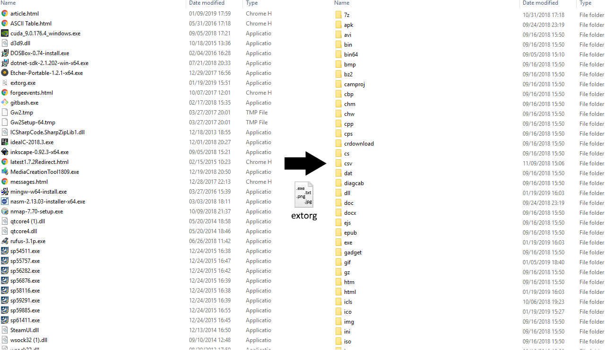

# About 

ExtOrg is an application written in C# that organizes files based on their extensions.

# License 

ExtOrg was created by [UnexomWid](https://uw.exom.dev). It is licensed under the [MIT](https://github.com/UnexomWid/ExtOrg/blob/master/LICENSE) license.

# Releases

>Note: versions with the suffix **R** are considered stable releases, while those with the suffix **D** are considered unstable.

[v1.1R](https://github.com/UnexomWid/ExtOrg/releases/tag/v1.1R) - January 19, 2019

[v1.2R](https://github.com/UnexomWid/ExtOrg/releases/tag/v1.2R) - May 28, 2023

# Usage

ExtOrg moves all files from the working directory to folders named after their extensions. It does not affect files in the subfolders. Example:
>D:/folder/file.txt -> D:/folder/txt/file.txt

If a file already exists in the destination folder, the application will prompt you to decide whether or not to overwrite that file. You can also choose to overwrite/skip these files in the future.

Files with no extension will not be touched.

# Options

*For more details, run **extorg.exe --help**.*

By default, ExtOrg uses the current directory as the working one. However, you can specify the working directory. Example:
>extorg.exe "D:/path/to/folder"

You can also specify how the application should handle *file-already-exists* conflicts. Example:
>extorg.exe -y // automatically overwrites existing files

>extorg.exe -n // automatically skips existing files